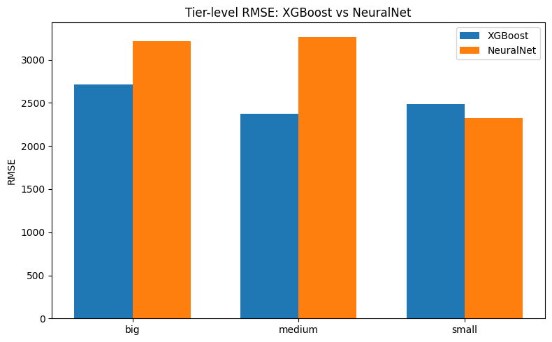
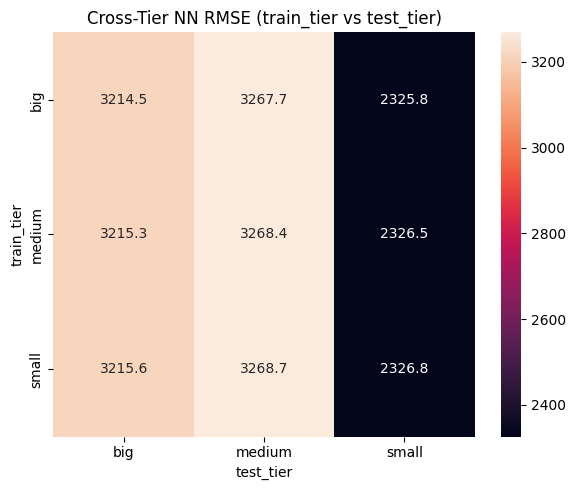
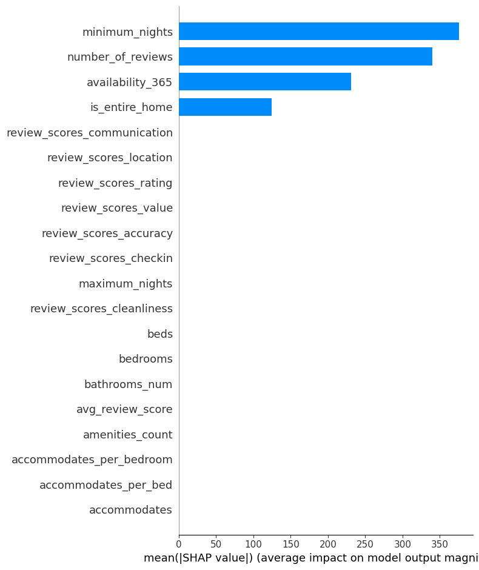

# Airbnb Price Prediction – XGBoost vs Neural Networks

*EAS 510 – Assignment 4 (Bakeoff)*

## 1. Overview

This repository contains my solution for **Assignment 4 – Bakeoff!** in EAS 510 (Basics of AI).

The goal is to build models that predict **Airbnb listing prices** and to compare the performance of:

* a **tree-based gradient boosting model (XGBoost)**, and
* **fully-connected neural networks (Dense MLPs)**.

To make the comparison more realistic, I work with data from **12 different cities** and group them into three **market tiers**:

* **Big:** New York City, Los Angeles, San Francisco, Chicago
* **Medium:** Austin, Seattle, Denver, Portland
* **Small:** Asheville, Santa Cruz, Salem, Columbus

For each tier, I train separate models, evaluate them at both the **tier level** and the **city level**, and then run a **cross-tier generalization experiment** for the neural networks.

The main code is in the notebook:

* `notebooks/Assignment4_Bakeoff.ipynb`

---

## 2. Data

### 2.1 Source

All data come from the public **Inside Airbnb** project:

> [http://insideairbnb.com/get-the-data/](http://insideairbnb.com/get-the-data/)

For each city listed below, I downloaded the `listings.csv` file for a specific **2025 snapshot** from the “Get the Data” page. The exact month/year used for each city is recorded in the table.

### 2.2 Cities, tiers, and snapshots

| City          | Short Key | Tier   | Data Month (2025) | Listings Count* |
| ------------- | --------- | ------ | ----------------- | --------------- |
| New York City | nyc       | Big    | October 2025      | 36,289          |
| Los Angeles   | la        | Big    | September 2025    | 46,158          |
| San Francisco | sf        | Big    | September 2025    | 7,801           |
| Chicago       | chi       | Big    | June 2025         | 8,631           |
| Austin        | aus       | Medium | June 2025         | 15,247          |
| Seattle       | sea       | Medium | September 2025    | 7,016           |
| Denver        | den       | Medium | September 2025    | 4,935           |
| Portland      | por       | Medium | September 2025    | 4,442           |
| Asheville     | ash       | Small  | June 2025         | 2,900           |
| Santa Cruz    | sc        | Small  | June 2025         | 1,761           |
| Salem         | sal       | Small  | September 2025    | 365             |
| Columbus      | col       | Small  | September 2025    | 2,901           |

* **Listings Count** is the number of rows in the raw `listings-*.csv` file before any filtering.
  I compute these counts in the notebook; they can be updated by re-running the data summary cell.

### 2.3 Directory structure

The project is organized as:

```text
ASSIGNMENT 4 BASICS OF AI/
├─ data/
│   ├─ nyc/listings-nyc-2025-10.csv
│   ├─ la/listings-la-2025-09.csv
│   ├─ sf/listings-sf-2025-09.csv
│   ├─ chi/listings-chi-2025-06.csv
│   ├─ aus/listings-aus-2025-06.csv
│   ├─ sea/listings-sea-2025-09.csv
│   ├─ den/listings-den-2025-09.csv
│   ├─ por/listings-por-2025-09.csv
│   ├─ ash/listings-ash-2025-06.csv
│   ├─ sc/listings-sc-2025-06.csv
│   ├─ sal/listings-sal-2025-09.csv
│   └─ col/listings-col-2025-09.csv
├─ notebooks/
│   └─ Assignment4_Bakeoff.ipynb
├─ figures/
└─ README.md
```

### 2.4 Reproducibility instructions

To reproduce my results:

1. Go to the **Inside Airbnb – Get the Data** page.
2. For each city above, download the `listings.csv` file from the specified 2025 snapshot.
3. Save or rename each file so that it matches the filenames under `data/` shown above.
4. Open `notebooks/Assignment4_Bakeoff.ipynb` and run all cells from top to bottom.

The notebook will:

* Load all 12 datasets through a common pipeline.
* Train the XGBoost and neural network models.
* Output all tables and figures used in this report.

---

## 3. Features

### 3.1 Base numeric features

From each `listings-*.csv` file I extract the numeric features required by the assignment (or clean them into numeric form):

* `accommodates`
* `bedrooms`
* `beds`
* `bathrooms_text` → parsed into numeric `bathrooms_num`
* `review_scores_rating`
* `review_scores_accuracy`
* `review_scores_cleanliness`
* `review_scores_checkin`
* `review_scores_communication`
* `review_scores_location`
* `review_scores_value`
* `number_of_reviews`
* `availability_365`
* `minimum_nights`
* `maximum_nights`

The **target variable** is:

* `price` – converted from strings like `$1,234.00` to a float, and used only as the label (never as a feature).

### 3.2 Engineered features (5 total)

To capture more meaningful relationships, I add the following engineered features and use them consistently for all cities:

1. **`accommodates_per_bedroom`**
   Definition: `accommodates / bedrooms` (handling division by zero).
   Intuition: reflects how dense the sleeping arrangement is; high values usually signal cheaper, more crowded listings.

2. **`accommodates_per_bed`**
   Definition: `accommodates / beds`.
   Intuition: similar idea, but based on beds; helps separate listings with many beds in few rooms.

3. **`avg_review_score`**
   Definition: average of the `review_scores_*` columns.
   Intuition: a single overall quality score; higher scores are typically associated with higher prices.

4. **`amenities_count`**
   Definition: count of amenities listed for the property.
   Intuition: listings with more amenities (Wi-Fi, parking, kitchen, etc.) tend to demand higher prices.

5. **`is_entire_home`**
   Definition: binary indicator (1 if `room_type == "Entire home/apt"`, else 0).
   Intuition: entire homes/apartments usually command a large price premium over private or shared rooms.

### 3.3 Cleaning and missing values

* All feature columns are coerced to numeric types.
* Rows with **missing or non-positive price** are dropped.
* Remaining missing values in the feature matrix are imputed using **per-column medians**.
* Columns are aligned so that all cities share the exact same feature set, enabling tier-level and cross-tier models.

---

## 4. Models

### 4.1 XGBoost (tree-based model)

I use `xgboost.XGBRegressor` with the following hyperparameters (fixed across tiers for a fair comparison):

* `n_estimators = 300`
* `learning_rate = 0.05`
* `max_depth = 6`
* `subsample = 0.8`
* `colsample_bytree = 0.8`
* `objective = "reg:squarederror"`
* `random_state` fixed for reproducibility.

For each market tier (big, medium, small), I:

1. Concatenate the training data from all four cities in that tier.
2. Train a **single XGBoost model** on the combined tier data.
3. Evaluate it on a held-out tier test set.

### 4.2 Neural networks (Dense MLPs)

Using TensorFlow / Keras, I define two fully-connected neural network architectures:

* **Model A**
  Hidden layers: 64 → 32 (ReLU activations); output: single linear neuron.

* **Model B**
  Hidden layers: 128 → 64 → 32 (ReLU activations); output: single linear neuron.

For each tier:

1. Standardize features using `StandardScaler`.
2. Train **both** models with:

   * Loss: Mean Squared Error (MSE).
   * Optimizer: Adam.
   * Validation split: 20% of the training data.
   * Early stopping on validation loss (`patience = 5`, `restore_best_weights = True`).
3. Choose the **better model** based on validation RMSE and treat it as that tier’s **neural network model**.

---

## 5. Evaluation

### 5.1 Metrics

For all models I compute:

* **RMSE** – Root Mean Squared Error.
* **MAE** – Mean Absolute Error.
* **R²** – Coefficient of determination.

I report metrics at different levels:

1. **Tier-level overall performance** – compare XGBoost vs neural networks on the tier test set (big, medium, small).
2. **Individual city performance** – using the tier models, compute RMSE/MAE/R² for each of the 12 cities by slicing the test set by city.
3. **Cross-tier neural network analysis** – train an NN on one tier and evaluate it on the other two tiers, summarizing results in a 3×3 matrix (train tier vs test tier).
4. **Model interpretability** – use SHAP on the **big-tier XGBoost model** to measure feature importance and understand which variables drive price predictions.

All tables and plots are generated in the notebook and can be regenerated by running the cells.

---

## 6. Results summary

### 6.1 Individual city performance

City-level metrics show that **XGBoost** generally achieves lower RMSE and MAE than the neural network across the 12 cities. For example, with the tier models:

* In New York City, the XGBoost RMSE is about **3,362**, while in Los Angeles it is about **2,016**, and in Chicago about **3,352**.
* Smaller markets such as Asheville and Salem have lower absolute RMSE (around **416** and **669** respectively) because overall price levels are lower, but R² values remain modest, reflecting higher noise and missing factors.

Overall, tree-based models are more stable across heterogeneous markets, while neural networks are competitive in some cities but do not consistently beat XGBoost.

### 6.2 Composite tier analysis (big vs medium vs small)



At the **tier level**, aggregating cities within each market size, the comparison is:

* **Big tier (NYC, LA, SF, Chicago):**

  * XGBoost RMSE ≈ **2,712**, NN RMSE ≈ **3,215**.
  * XGBoost reduces error by roughly **500** units and achieves a better R² (~0.27 vs negative for NN).

* **Medium tier (Austin, Seattle, Denver, Portland):**

  * XGBoost RMSE ≈ **2,372**, NN RMSE ≈ **3,268**.
  * The gap is even larger here; the tree-based model clearly dominates.

* **Small tier (Asheville, Santa Cruz, Salem, Columbus):**

  * XGBoost RMSE ≈ **2,484**, NN RMSE ≈ **2,327**.
  * This is the only tier where the NN edges out XGBoost in RMSE, but overall R² values are still low for both, indicating that small markets are harder to model.

### 6.3 Cross-tier neural network analysis



The cross-tier experiment trains a neural network on one tier and evaluates it on all tiers. The RMSE matrix (train tier × test tier) looks like:

* Training on **big**: RMSE ≈ **3214.5** on big, **3267.7** on medium, **2325.8** on small.
* Training on **medium**: RMSE ≈ **3215.3** on big, **3268.4** on medium, **2326.5** on small.
* Training on **small**: RMSE ≈ **3215.6** on big, **3268.7** on medium, **2326.8** on small.

Patterns:

* Each model performs **best on the tier it was trained on**, especially when comparing big vs medium.
* Generalization between big and medium tiers is possible but slightly worse than in-domain performance.
* All three NNs achieve their lowest RMSE when tested on the **small tier**, but this tier also has different price scales and lower absolute prices, so R² remains low.

Overall, this experiment confirms that **market tier matters**. There is no single neural network that clearly dominates across all tiers; training one model per tier is more reliable.

### 6.4 SHAP feature importance (big-tier XGBoost)



SHAP analysis on the big-tier XGBoost model shows that the most influential features are:

* **`minimum_nights`**
* **`number_of_reviews`**
* **`availability_365`**
* **`is_entire_home`**

These features dominate the mean absolute SHAP values. Review-related scores (communication, location, rating, value, accuracy, cleanliness) also contribute but are less important than availability and minimum-stay rules. This is intuitive: pricing in large cities is strongly affected by how long guests must stay, how often the listing is booked, and whether it is an entire home vs a private room.

---

## 7. How to run

1. **Environment setup**
   You can use a local virtual environment or a platform like VS Code / Jupyter. Install the required Python packages:

   ```bash
   pip install pandas numpy matplotlib seaborn scikit-learn xgboost shap tensorflow
   ```

2. **Data**
   Download the 12 `listings.csv` files from Inside Airbnb as described in Section 2 and rename/move them to the `data/<city>/listings-<city>-YYYY-MM.csv` paths shown earlier.

3. **Notebook**
   Open `notebooks/Assignment4_Bakeoff.ipynb`, run all cells from top to bottom, and the notebook will:

   * Build the data pipeline.
   * Train XGBoost and neural network models for each tier.
   * Evaluate them at city and tier levels.
   * Produce the cross-tier NN heatmap and SHAP plots.

---

## 8. Notes and limitations

* The results depend on the specific **2025 snapshots** from Inside Airbnb. Newer snapshots may change the exact numbers but the code will still run.
* Only tabular features are used; location (geo-coordinates) and text descriptions are not included, which limits the achievable R².
* Hyperparameters for XGBoost and neural networks are kept relatively simple to focus on the comparison, not on exhaustive tuning.

---

By following this README and the accompanying notebook, another student or instructor should be able to reproduce my full workflow, understand my modeling choices, and verify how XGBoost and neural networks perform across different Airbnb market tiers.
